#### Step 1

#### Created a VPC

---

 

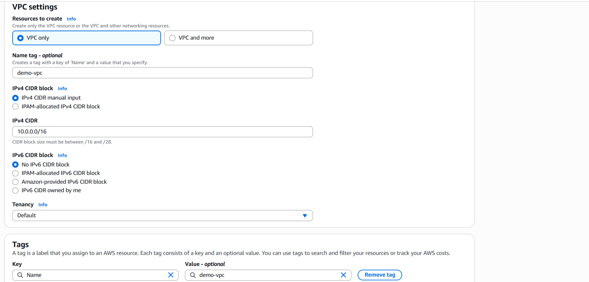

 

---

#### Step 2

#### Created 4 subnets, a)PublicSubnetA b)PublicSubnetB c)PrivateSubnetA d)PrivateSubnetB

 

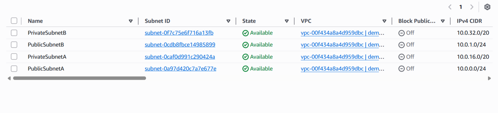

 

---

#### Step 3

#### Created Internet Gateway

 

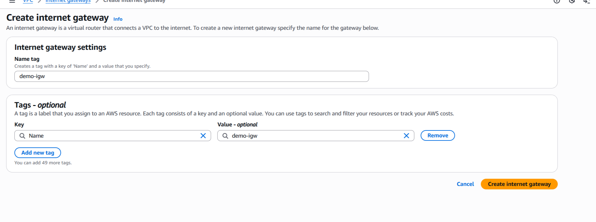

 

---

#### Step 4

#### Attached Internet Gateway to VPC

 

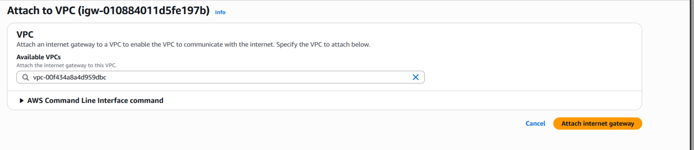

 

---

#### Step 5

#### Created a PublicRouteTable and a PrivateRouteTable

 

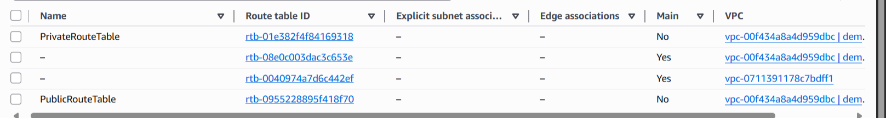

 

---

#### Step 6

#### Associated the public subnets with the PublicRouteTable to enable internet access for resources in that subnet

 

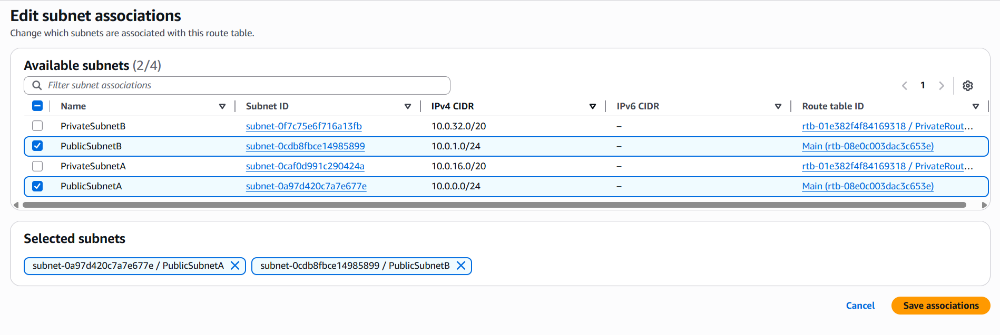

 

---

#### Step 7

#### Associated the private subnets with the PrivateRouteTable.

 

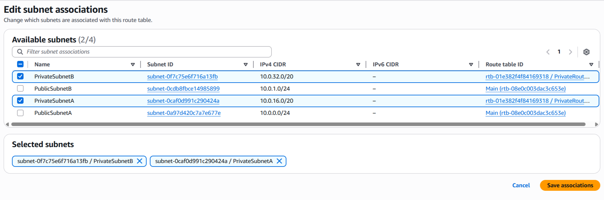

 

---

#### Step 8

#### Added routes. Created a route in the PublicRouteTable with a destination of 0.0.0.0/0 and selected the Internet Gateway as the target.

 

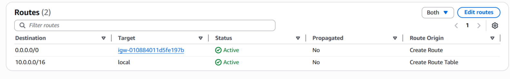

 

---

#### Step 9

#### Created a security group for the bastion host and named it: `bastion-host-sg`

 

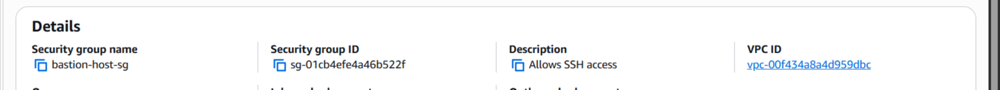

 

---

#### Step 10

#### Edited the subnet settings of both PublicSubnet A and PublicSubnetB by selecting, `enable auto-assign public Ipv4 address`.

 

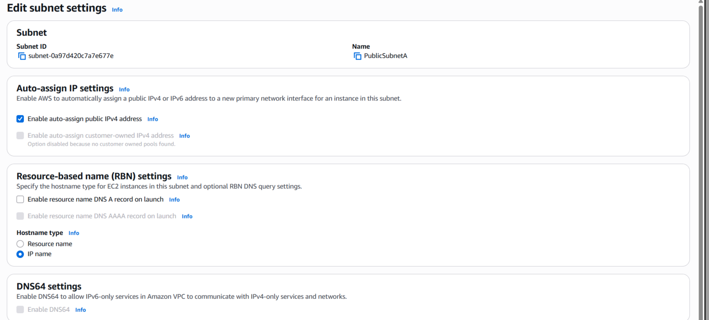

 

---

#### Step 11

#### Created an EC2 instance named `bastion-host` in PublicSubnetB

 

 

---

#### Step 12

#### Successfully connected to the bastion-host and pinged ietf.org as recommended by AWS.

 

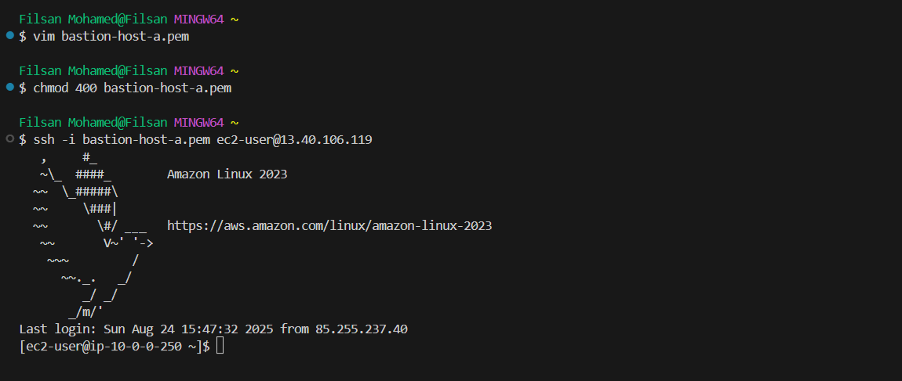

 

---

#### Step 13

#### Created a security group called `private-server-sg` for the 2 private instances in the private subnets, `private-server-a` in PrivateSubnetA and `private-server-b` in PrivateSubnetB.

 

 

---

#### Step 14

#### Created the EC2 instance `private-server-a` in the PrivateSubnetA.

 

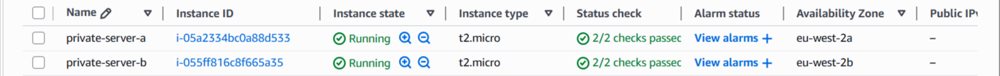

 

---

#### Step 15

#### Created a public NAT gateway in `PublicSubnetA` and clicked on `Allocate Elastic IP` to have an Elastic IP automatically allocated for the Public NAT gateway.

 

 

---

#### Step 16

#### Updated the private route table by adding a route of which the `destination` is `0.0.0.0/0` and the `target` is the NAT gateway that you created in step 15. This was done so that traffic goes through NAT Gateway.

 

 

---

#### Step 17

#### Accessed the private-server-a EC2 instance in Availability zone A, by going through the bastion-host using SSH and used the command `ping ietf.org` in the private-server-a EC2 instance, to show that the private-server-a EC2 has outbound internet connectivity.

 

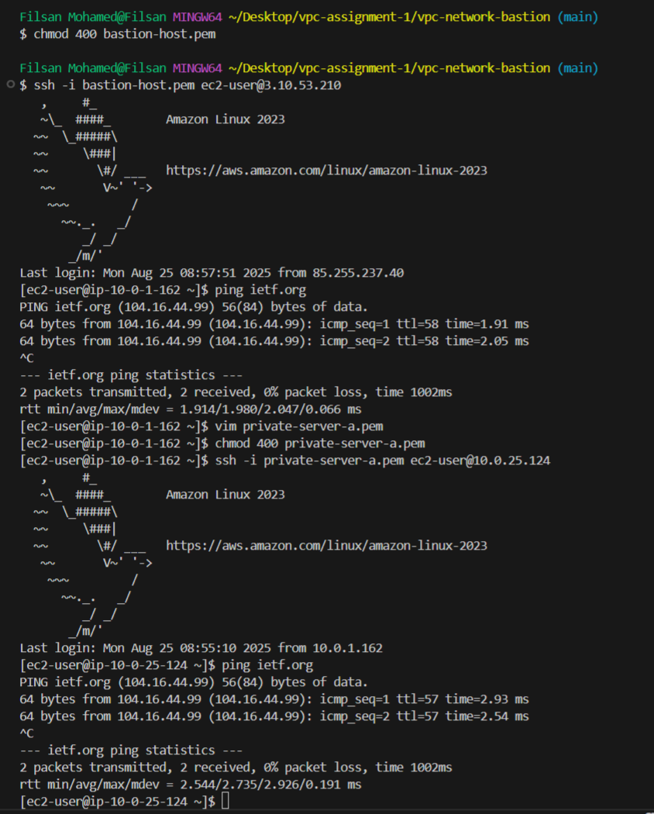

 

---

#### Step 18

#### Accessed the private-server-b EC2 instance in Availability zone B, by going through the bastion-host using SSH and used the command `ping ietf.org` in the private-server-b EC2 instance, to show that the private-server-b EC2 has outbound internet connectivity.

 

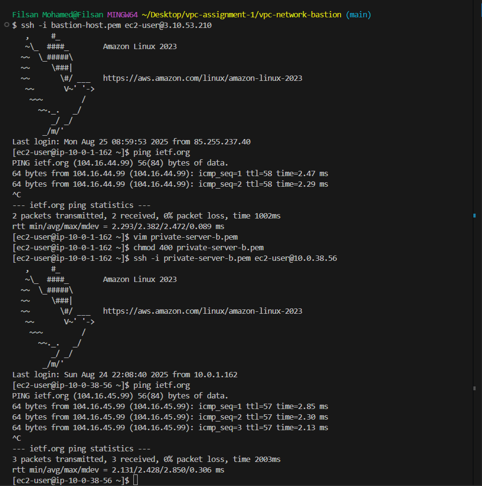

 

---
