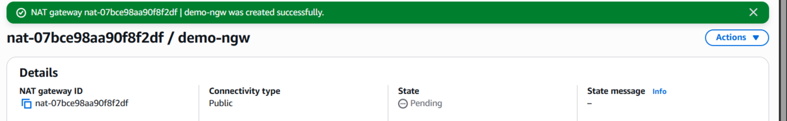
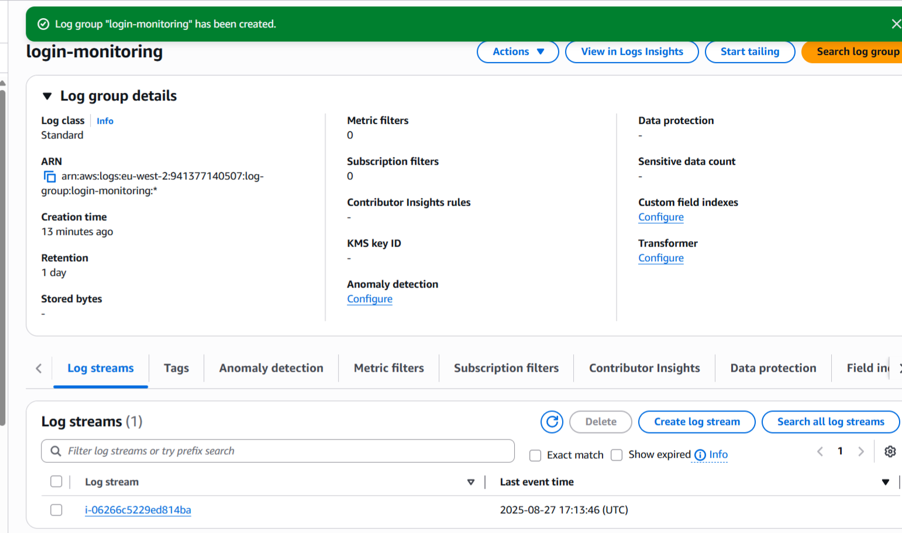

## 📄 Project Description

Project Description

The project consists of a VPC that has both public and private subnets across two Availability Zones, an Internet Gateway for public resources, and a NAT Gateway to allow outbound internet access for private instances.

A bastion host is deployed in the public subnet to provide secure SSH access to the private EC2 instances private-server-a and private-server-b. The private servers are placed in the private subnets and can only be accessed via the bastion host.

The CloudWatch Agent was installed on the bastion host to collect system metrics (CPU, memory, disk) and forward login audit logs for monitoring and troubleshooting.

---

---

### Step 1

### Created a custom VPC with a 10.0.0.0/16 CIDR block.

---

 

 

---

### Step 2

### Created 4 subnets across two Availability Zones: two public subnets(PublicSubnetA/B) and two private private subnets (PrivateSubnetA/B).

 

 

---

### Step 3

### Created an Internet Gateway to enable internet access for public subnets.

 

 

---

### Step 4

### Connected the Internet Gateway to the VPC to enable internet access for the public subnets.

 

 

---

### Step 5

### Created separate route tables to manage traffic routing for public and private subnets in the VPC

 

 

---

### Step 6

### Associated/Linked the Public Route Table with public subnets so resources in those subnets can access the internet.

 

 

---

### Step 7

### Linked/associated the Private Route Table with private subnets to control routing for the instances in the private subnets.

 

 

---

### Step 8

### Added a route (0.0.0.0/0) in the Public Route Table to direct internet traffic through the Internet Gateway.

 

 

---

### Step 9

### Created a security group (`bastion-host-sg`) allowing only SSH inbound traffic from trusted IPs to the bastion host.

 

 

---

### Step 10

### Edited the subnet settings of both PublicSubnet A and PublicSubnetB by selecting, `enable auto-assign public Ipv4 address`.

### Enabled auto-assign public IPv4 addresses for PublicSubnetA and PublicSubnetB so instances in PublicSubnetA and PublicSubnetB get a public IP automatically.

 

 

---

### Step 11

### Launched an EC2 instance (`bastion-host`) in PublicSubnetB

 

 

---

### Step 12

### Successfully connected to the bastion-host and pinged ietf.org as recommended by AWS to verify internet access.

 

 

---

### Step 13

### Created a security group called `private-server-sg` for the 2 private instances in the private subnets, `private-server-a` in PrivateSubnetA and `private-server-b` in PrivateSubnetB.

 

 

---

### Step 14

### Launched the EC2 instance `private-server-a` in the PrivateSubnetA and the `private-server-b` in the PrivateSubnetB.

 

 

---

### Step 15

### Created a public NAT gateway in `PublicSubnetA` and clicked on `Allocate Elastic IP` to have an Elastic IP automatically allocated for the Public NAT gateway.

 

 

---

### Step 16

### Configured the private route table to route 0.0.0.0/0 traffic via the NAT Gateway for internet access.

 

 

---

### Step 17

### Accessed the `private-server-a` EC2 instance in Availability zone A, by going through the `bastion-host` in PublicSubnetB, using SSH and after that the command `ping ietf.org` in the `private-server-a` EC2 instance, to show that the `private-server-a` EC2 has outbound internet connectivity.

 

 

---

### Step 18

### Accessed the `private-server-b` EC2 instance in Availability zone B, by going through the bastion-host in the PublicSubnetB using SSH and used the command `ping ietf.org` in the `private-server-b` EC2 instance, to show that the `private-server-b` EC2 has outbound internet connectivity.

 

 

---

### Step 19

### Installed the CloudWatch Agent on the bastion-host EC2 instance and configured a config.json file. Memory and disk utilisation metrics were collected from the instance and sent to Amazon CloudWatch as you can see below.

 

---

### Step 20

### SSH/audit logs were also collected and streamed to the `login-monitoring` log group in CloudWatch Logs.

 

---
